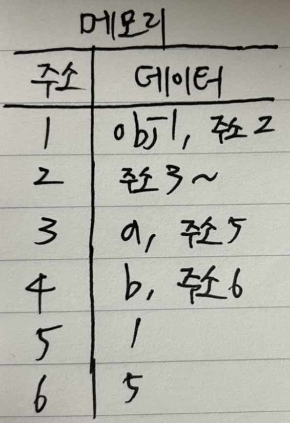
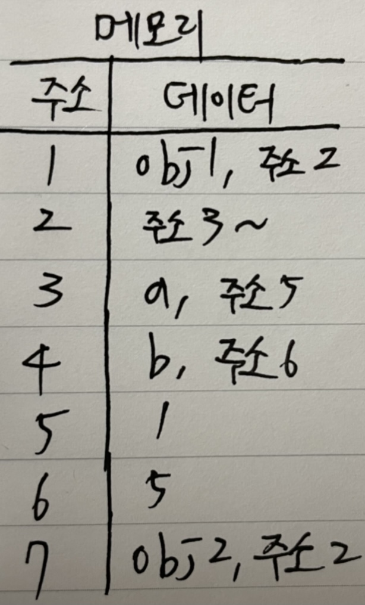
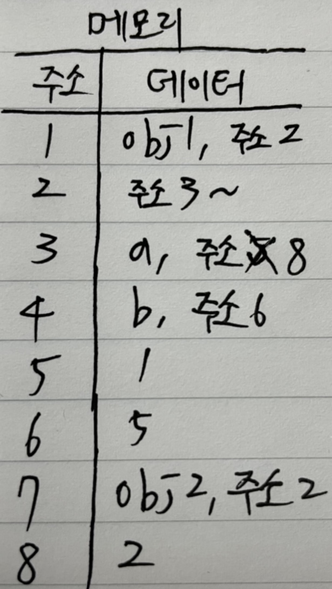
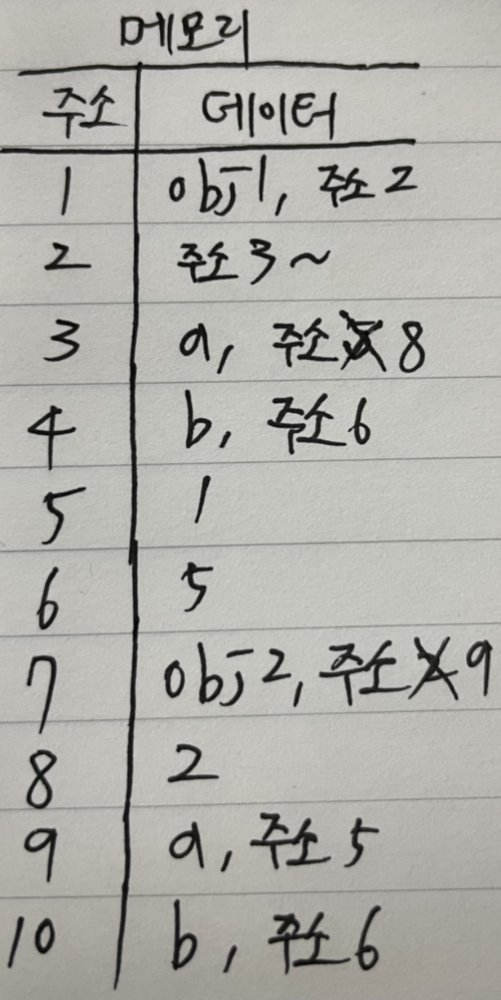

# call by sharing

이진탐색트리를 구현해보다가 에러가 계속 발생하길래 살펴보니 예상과 다른 방식의 결과가 나오고 있었다.

함수의 인자로 객체를 넘겼을때, 객체 자체를 바꾸면 기존의 인자로 넘겨준 객체는 바뀌지 않고 새로운 객체가 만들어졌다면 객체의 프로퍼티를 바꾸면 인자로 넘겨준 객체가 바뀌었다.

그간 접한 원시타입의 call by value 혹은 객체의 call by reference 동작과는 달라서 이 현상 자체를 받아들이고 이해하는데 오래 걸렸다.

검색을 해보고 싶었으나 어떻게 해야할지 잘 몰랐으나 다행히 '자바스크립트 call by reference'를 검색하고서 원하는 [답변](https://perfectacle.github.io/2017/10/30/js-014-call-by-value-vs-call-by-reference/)을 바로 얻을 수 있어서 정말 다행이라고 느꼈다.

객체를 함수의 인자로 넘길때 마치 call by value 처럼 복사본을 넘기는데, 객체의 프로퍼티가 변화할 때는 call by reference 처럼 동작을 하고 객체에 아예 새로운 값을 대입하면 인자로 넘겨준 객체와 분리되는 이러한 현상을 **call by sharing** 으로 이를 지칭하고 있었다.

<br>

이는 객체의 얕은 복사와 연결 될 수 있다. 

<br>

```javascript
const obj1 = {
  a: 1,
  b: 5
};
const obj2 = obj1;
console.log(obj1 === obj2);
// true

obj1.a = 2;

console.log(obj1.a)
console.log(obj2.a)
// 2
// 2
```

<br>

위의 예시에서 obj1 객체를 obj2에 그대로 넣어줬다. 이때는 얇은 복사가 되어서 obj1이 바라보는 { a: 1, b: 5} 라는 값 자체의 메모리 주소를 obj2도 바라보게 된다. obj1과 obj2는 같은 메모리 주소를 바라보고 있는 상황이다. { a: 1, b: 5 } 값 자체의 메모리 주소에서는 프로퍼티 a, b를 담고 있는 메모리 주소를 갖는다. a, b 각각 메모리 주소를 갖고 이 주소 안에 1, 5를 갖는 메모리 주소를 담고 있다.



<br>



<br>

a 프로퍼티의 값이 바뀌면 a는 1을 바라보던 메모리 주소에서 2를 바라보는 새 메모리 주소를 갖게 된다. 그러면 obj1과 obj2는 프로퍼티 a가 있는 메모리 주소를 함께 보고 있었기 때문에 a 안에서 바라보고 있는 메모리 주소가 바뀌더라도 obj1이나 obj2가 바라보는 메모리 주소에는 영향을 끼치지 않고 그대로다. 그래서 obj1과 obj2는 여전히 같은 a를 바라보고 있고 a만 바라보고 있는 메모리 주소가 바뀌게 된 것이다.



<br>

```javascript
let obj1 = {
  a: 1,
  b: 5,
}
const obj2 = obj1;
obj1 = {
  a: 2,
  b: 5
};

console.log(obj1.a);
console.log(obj2.a);
// 2
// 1
```

<br>

여기서는 obj1의 값을 obj2에 대입을 했다가 obj1에 새로운 값을 재할당 한다. obj1과 obj2가 같은 주소를 바라보다가 obj1에 아예 객체를 새로 할당하면서 obj1이 바라보는 메모리 주소가 바뀌게 된다. 새로운 메모리 주소에서 새로 할당한 객체를 바라보게 된다.



<br>

```javascript
var obj1 = {
    a: 1,
    b: 5,
};
var obj2 = obj1;
obj2 = {
    a: 1,
    b: 5,
}

console.log(obj1 === obj2)
// false
```

설령 똑같은 값을 갖는 객체를 새로 할당하더라도 객체 자체를 새로 할당하면서 바라보는 메모리 주소 자체가 바뀌었기 때문에 obj1과 obj2는 더 이상 같지 않다.

<br>

<참고>

https://perfectacle.github.io/2017/10/30/js-014-call-by-value-vs-call-by-reference/

https://dev.to/ufko/javascript-uses-call-by-sharing-for-objects-30og

https://milooy.github.io/TIL/JavaScript/call-by-sharing.html#%E1%84%80%E1%85%A7%E1%86%AF%E1%84%85%E1%85%A9%E1%86%AB

코어자바스크립트(정재남)